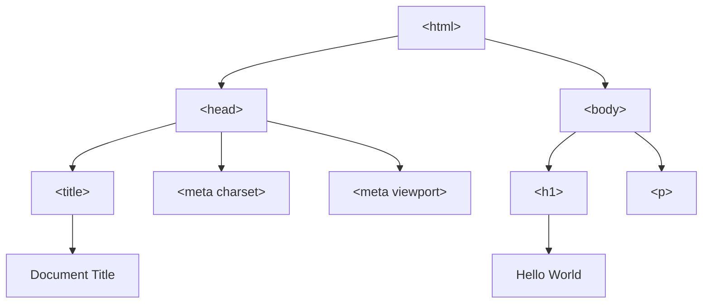

# HTML Fundamentals

## Table of Contents
* [1. High-Level Overview](#1-high-level-overview)
* [2. HTML Tags](#2-html-tags)
* [3. HTML Document Structure](#3-html-document-structure)
* [4. The Document Object Model (DOM)](#4-the-document-object-model-dom)
* [5. Elements and Attributes](#5-elements-and-attributes)
* [6. Inline vs. Block Elements](#6-inline-vs-block-elements)
* [7. Common HTML Tags](#7-common-html-tags)

***

## 1. High-Level Overview

**HTML (HyperText Markup Language)** is the standard markup language used to create the structure of web pages. It is not a programming language; rather, it is a system of **tags** and **attributes** that tell a web browser how to display text, images, links, and other media.

Think of HTML as the **skeleton** of a webpage. While CSS provides the "skin" (styling) and JavaScript provides the "muscles" (interactivity), HTML provides the essential bones that hold everything together.

[↑ Back to Table of Contents](#table-of-contents)

***

*Now that we have established what HTML is, let's look at the specific tools used to build it: Tags.*

## 2. HTML Tags

**Tags** are the fundamental building blocks of HTML. They are used to mark the beginning and end of an element.

### Anatomy of a Tag
Most HTML elements consist of an **opening tag**, the **content**, and a **closing tag**.

```html
<tagname>Content goes here...</tagname>
```

*   **`<tagname>` (Opening Tag):** Tells the browser where the element begins.
*   **`Content`:** The actual text, images, or other elements contained within.
*   **`</tagname>` (Closing Tag):** Tells the browser where the element ends. The forward slash `/` is the key indicator.

### Self-Closing Tags (Void Elements)
Some elements do not have a closing tag because they do not wrap around any content. These are called **void elements** or **self-closing tags**.

*   `<br>`: A line break.
*   ``: An image.
*   `<hr>`: A horizontal rule (line).
*   `<input>`: An input field.

> [!TIP]
> In modern HTML5, the trailing slash (e.g., `<br />`) is optional for void elements, but consistency is key for readability.

[↑ Back to Table of Contents](#table-of-contents)

***

*Understanding how to write individual tags is important, but we must also understand how they fit together to form a complete, valid web document.*

## 3. HTML Document Structure

Every professional HTML document must follow a specific, standardized structure to be interpreted correctly by browsers.

### The Boilerplate
A standard HTML5 document looks like this:

```html
<!DOCTYPE html>
<html lang="en">
<head>
    <meta charset="UTF-8">
    <meta name="viewport" content="width=device-width, initial-scale=1.0">
    <title>Document Title</title>
</head>
<body>
    <!-- Visible content goes here -->
    <h1>Hello World</h1>
</body>
</html>
```

### Breakdown of Components

| Component | Description |
| :--- | :--- |
| `<!DOCTYPE html>` | The **Document Type Declaration**. It tells the browser that this is an HTML5 document. |
| `<html lang="en">` | The **Root Element**. It wraps all other content. The `lang` attribute specifies the primary language. |
| `<head>` | The **Metadata Container**. It contains information *about* the page that isn't directly visible to the user (e.g., title, character set, CSS links). |
| `<meta charset="UTF-8">` | Specifies the **Character Encoding** (UTF-8 covers almost all characters and symbols). |
| `<title>` | Sets the text displayed on the browser tab. |
| `<body>` | The **Content Container**. This is where all the visible parts of your webpage (text, images, buttons) live. |

[↑ Back to Table of Contents](#table-of-contents)

***

*While the structure defines the physical file, the browser views that file through a different lens: the DOM.*

## 4. The Document Object Model (DOM)

The **DOM (Document Object Model)** is a programming interface for web documents. When a browser loads your HTML, it transforms the text into a tree-like object structure.

### The DOM Tree
The DOM represents the document as a hierarchy of **nodes**.

*   **Root Node:** The `<html>` element.
*   **Parent Nodes:** Elements that contain other elements (e.g., `<body>` is the parent of `<h1>`).
*   **Child Nodes:** Elements contained within another (e.g., `<h1>` is a child of `<body>`).
*   **Leaf Nodes:** The actual text inside an element.

To make this concrete, here is the DOM tree that a browser builds from the boilerplate in [Section 3](#3-html-document-structure). Each box is a node; the lines show the parent/child relationships:



### Why the DOM Matters
The DOM is what allows languages like **JavaScript** to interact with your HTML. When you use JavaScript to "change the text of a heading" or "hide an image," you aren't actually editing the `.html` file; you are manipulating the **DOM tree** in the browser's memory.

[↑ Back to Table of Contents](#table-of-contents)

***

*Now that we understand the structural hierarchy, let's dive into the specific details of the building blocks: Elements and their Attributes.*

## 5. Elements and Attributes

An **Element** is the combination of the tags and the content. An **Attribute** provides additional information about an element.

### Elements
An element is the whole package:
`<p>This is a paragraph element.</p>`

### Attributes
Attributes are always placed inside the **opening tag** and usually come in name/value pairs like `name="value"`.

**Common Attributes:**
*   `id`: A **unique** identifier for an element. No two elements in a document should share the same ID.
*   `class`: A non-unique identifier used to group multiple elements (often for CSS styling).
*   `src`: Specifies the path to an external resource (used in ``).
*   `href`: Specifies the URL for a link (used in `<a>`).
*   `alt`: Provides "alternative text" for images (essential for accessibility).

### Comparison: ID vs. Class

| Feature | **ID** | **Class** |
| :--- | :--- | :--- |
| **Uniqueness** | Must be unique to **one** element. | Can be used on **multiple** elements. |
| **Purpose** | Targeting a single, specific element. | Grouping elements for shared styles/behavior. |
| **CSS Symbol** | `#element-id` | `.element-class` |

[↑ Back to Table of Contents](#table-of-contents)

***

*Not all elements behave the same way on a page. They are categorized by how they occupy space: Inline vs. Block.*

## 6. Inline vs. Block Elements

In the CSS box model, every element is either a **Block-level** element or an **Inline** element. This determines how they flow and stack on the page.

### Block-Level Elements
*   **Behavior:** They always start on a **new line** and take up the **full width** available (stretching from left to right).
*   **Structure:** They can contain both other block-level elements and inline elements.
*   **Examples:** `<div>`, `<h1>` through `<h6>`, `<p>`, `<ul>`, `<li>`, `<section>`.

### Inline Elements
*   **Behavior:** They do **not** start on a new line. They only take up as much width as their content requires.
*   **Structure:** They should generally only contain data or other inline elements; putting a block-level element inside an inline element is usually invalid HTML.
*   **Examples:** `<span>`, `<a>`, `<strong>`, `<em>`, ``.

### Comparison Summary

| Characteristic | **Block** | **Inline** |
| :--- | :--- | :--- |
| **New Line?** | Yes | No |
| **Width** | Full width of container | Only as wide as content |
| **Containment** | Can contain Block & Inline | Usually only contains Inline |

[↑ Back to Table of Contents](#table-of-contents)

***

*Finally, let's wrap up with a quick reference guide to the most frequently used tags in web development.*

## 7. Common HTML Tags

This is a quick-reference cheat sheet for the tags you will use 90% of the time.

### Text Content
*   `<h1>` to `<h6>`: **Headings** (h1 is the most important, h6 the least).
*   `<p>`: **Paragraph** for blocks of text.
*   `<strong>`: Indicates **strong importance** (usually rendered as bold).
*   `<em>`: Indicates **emphatic stress** (usually rendered as italics).
*   `<ul>`: **Unordered List** (bullet points).
*   `<ol>`: **Ordered List** (numbered list).
*   `<li>`: **List Item** (the individual entries inside a `<ul>` or `<ol>`).

### Links and Media
*   `<a>`: **Anchor** (creates hyperlinks using the `href` attribute).
*   ``: **Image** (embeds images using the `src` and `alt` attributes).

### Structural/Container Tags
*   `<div>`: **Division** (a generic block-level container used for layout and grouping).
*   `<span>`: **Span** (a generic inline container used to style specific parts of text).
*   `<header>`, `<footer>`, `<nav>`, `<main>`, `<section>`: **Semantic Tags** (tells the browser and search engines exactly what part of the page they are looking at, improving SEO and accessibility).

> [!IMPORTANT]
> **Semantic HTML is crucial.** Instead of using `<div>` for everything, use `<nav>` for navigation or `<header>` for the top of your page. This makes your code more readable for developers and more accessible for screen readers used by visually impaired users.

[↑ Back to Table of Contents](#table-of-contents)
